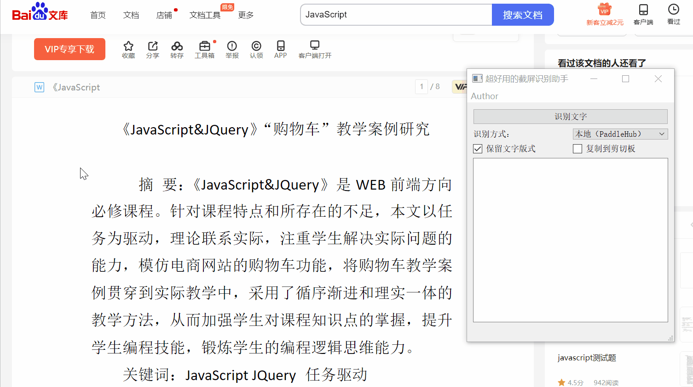

# DEMO

# ENVIRONMENT

- Window 10
- Miniconda3

# INSTALL

1. `cd ScreenRec` 
2. `conda create -n ocr python=3.7`  create conda virtual environment
3. `conda activate ocr` enter the virtual environment
4. `pip install -r requirements.txt` install dependency libraries

# USAGE

1. run `main.py`

2. add `API Key` and `Secret Key` to `screen_rec.py` if you want to use baidu API, you can get it from [this](https://cloud.baidu.com/product/ocr_general) .

